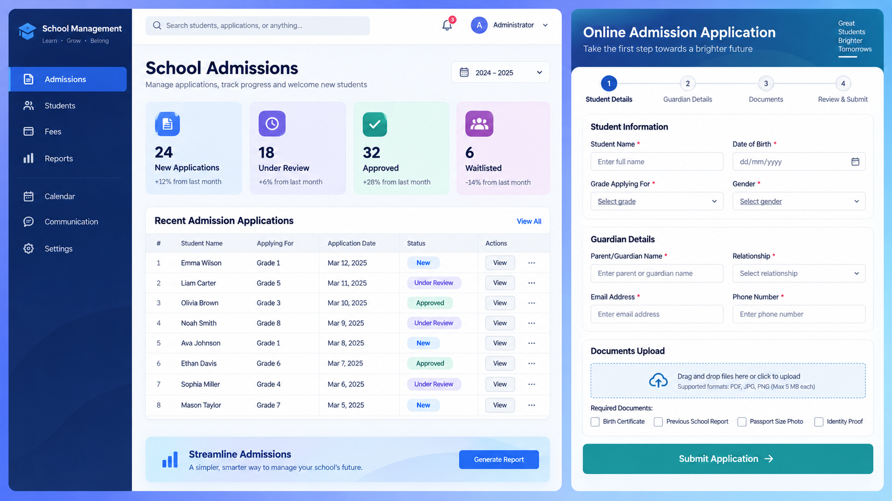
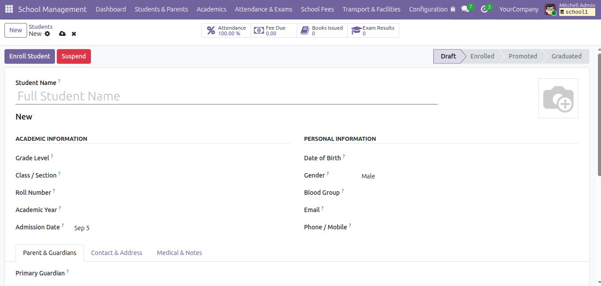
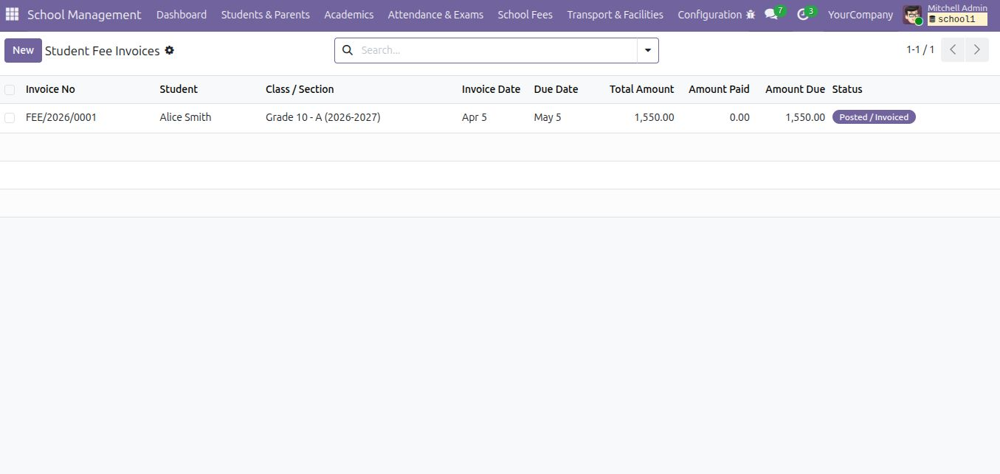
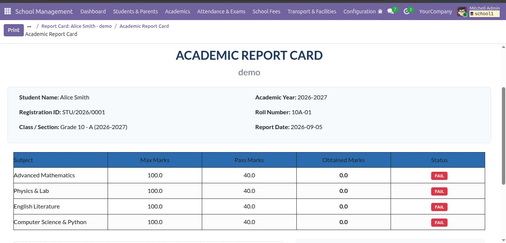

# SDS School Management System

A complete school operations module for Odoo 19. Manage the student lifecycle, academic structure, admissions, fees, attendance, examinations, library circulation, transport, hostel allocation and printable school reports from one application.


## Highlights

- Student profiles with enrollment states, guardians, contact details, medical notes and smart statistics.
- Public online admission application with guardian details, academic-year selection and supporting documents.
- Admission review workflow: New, Under Review, Approved and Rejected.
- Automatic student and parent creation when an admission is approved.
- Academic years, terms, grades, classes, sections, subjects and teacher assignments.
- Daily class attendance with bulk student loading and present/absent counts.
- Exams, grading scales, subject marks and printable academic report cards.
- Fee heads, grade-level fee structures, student fee statements, payment status and printable receipts.
- Parent portal fee statements restricted to explicitly linked portal users.
- Library books and issue/return records.
- Transport routes, vehicles and student registrations.
- Hostel buildings, rooms and student allocations.
- Student ID cards, academic report cards and fee receipts in PDF format.
- Demo data for a quick evaluation installation.

## Screenshots

### Online admissions

Applicants can submit student information, guardian contact details and supporting documents through the public website form.



### Student records



### Fee management



### Academic reporting



More product screenshots are available in [the App Store description page](SDS_school_management_system/static/description/index.html), including subjects, teachers, analytics, reports and fee dashboards.

## Requirements

- Odoo 19.0
- Python version supported by Odoo 19
- Odoo applications: `Website` and `Portal`

The module declares these dependencies automatically:

- `base`
- `mail`
- `website`
- `portal`

## Installation

1. Copy the `SDS_school_management_system` directory into an Odoo addons path.
2. Restart the Odoo server.
3. Activate developer mode and update the Apps list.
4. Search for **SDS School Management System** and install it.
5. Load the included demo data in a test database if you want sample students, fees, exams and library records.

For a source checkout, the module root is the directory containing `__manifest__.py`.

## First-time setup

1. Open **School Management > Configuration** and create the academic year, grades, subjects and grading scale.
2. Create classes and sections under **Students & Parents > Classes & Sections**.
3. Add teachers and assign subjects or class responsibilities.
4. Create fee heads and fee structures under **School Fees**.
5. Create or approve students and assign their academic year, grade, class and guardian.
6. Create attendance registers, exams, result lines and fee statements.
7. Print reports from the corresponding student, exam result or fee statement record.

## Admission portal

The public application is available at:

```text
/school/admission
```

The website navigation also exposes an **Admissions** link. Required fields are validated on the server. Uploads are limited to ten files, 5 MB per file, and PDF, Word, JPG or PNG formats. Uploaded documents are linked to the admission record and appear in its Documents tab.

Admissions staff review applications from **Students & Parents > Admissions**. Approving an application creates the student and the guardian record when they do not already exist.

## Parent fee portal

The authenticated fee page is available at:

```text
/my/school/fees
```

To allow a parent or guardian to see fee statements:

1. Create or open the guardian record.
2. Set **Portal User** to the matching Odoo user.
3. Link the guardian to the student in **Children / Wards**.
4. Give the user portal access through the standard Odoo user settings.

Fee data is resolved through the explicit `Portal User` relation. Matching an email address alone is intentionally not used to avoid exposing another account's student fees.

## User roles

- **School / Administrator**: full school configuration and operational management.
- **School / Teacher or Faculty**: school records needed for teaching and academic operations.
- **School / Parent or Guardian**: parent-facing role available for portal configuration.
- **School / Student**: student-facing role available for future portal extensions.

Review and adjust access rights for your own school policy before production use. Schools should also review who can access medical notes, guardian contact details and financial records.

## Reports

The module provides these printable reports:

- Student ID Card
- Academic Report Card
- Fee Payment Receipt

Reports are available from the related record's Print menu after installation.

## Technical structure

```text
SDS_school_management_system/
├── controllers/       Public admission and authenticated fee portal routes
├── data/              Number sequences
├── demo/              Demonstration academic, student and fee data
├── models/            School domain models
├── report/            QWeb PDF templates and report actions
├── security/          Groups and access-control entries
├── static/description/ App Store page, banner, icon and screenshots
└── views/             Backend views, menus and portal templates
```

## Validation

The repository can be checked without an Odoo server with:

```bash
python3 -m compileall -q SDS_school_management_system
python3 - <<'PY'
from pathlib import Path
from xml.etree import ElementTree
for path in Path('SDS_school_management_system').rglob('*.xml'):
    ElementTree.parse(path)
print('Python and XML validation passed.')
PY
git diff --check
```

A live Odoo upgrade/install test should also be run against the target Odoo 19 deployment before publishing a release.

## License and support

Released under the LGPL-3 license. The package metadata identifies SmartDeskSolution as the author and maintainer.

- Website: https://www.smartdesksolution.com
- Email: info@smartdesksolution.com
